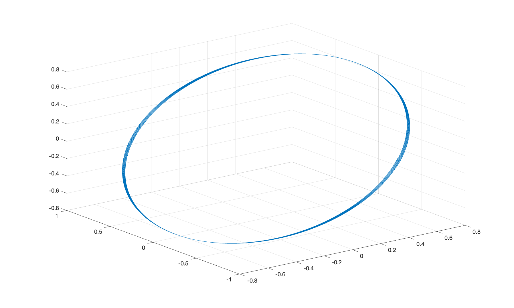
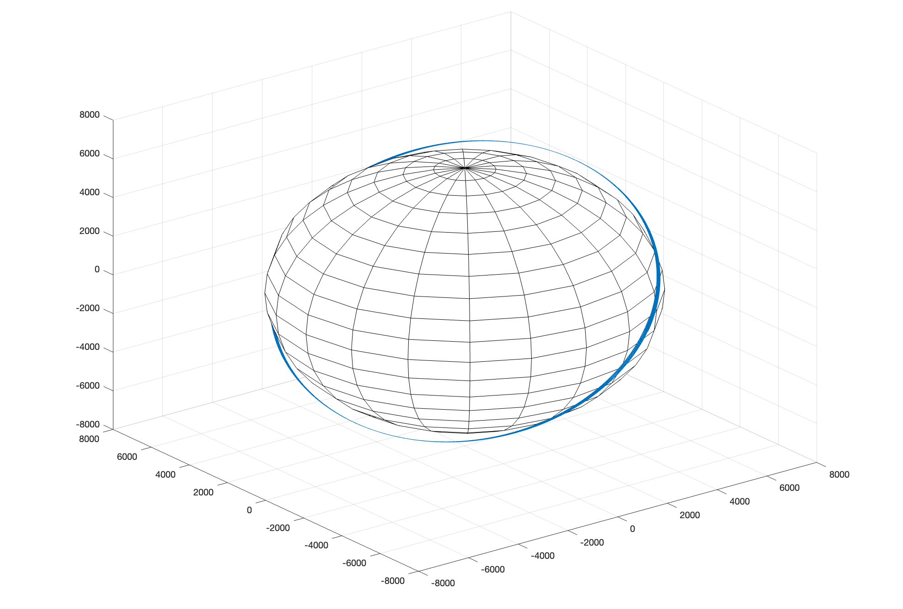
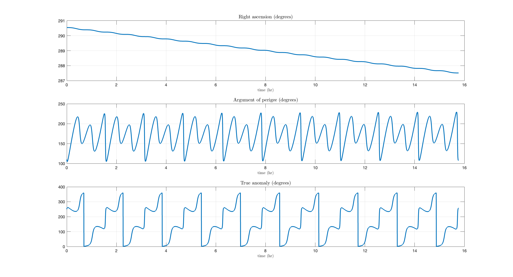

# Orbital-determination-with-J2

     
     
     
       

At time $t_0$, a spacecraft has the following orbital elements in the Earth-centred inertial frame:

$$
\begin{align}
    a_0 = 6878\text{ km},\hspace{0.4cm}e_0 = 1.3\times10^{-4},\hspace{0.4cm}i_0 = 53^{\circ}\\
    \Omega_0 = 290.5^{\circ},\hspace{0.4cm}\omega_0=110^{\circ},\hspace{0.4cm}\theta_0 = 250^{\circ}\\
\end{align}
$$

where $\theta_0$ us the initial true anomaly
Assume that the trajectory of the spacecraft is affected by the main Earth gravitational acceleration and by the oblateness perturbation exclusively.

- [x] Transform the initial state vector in osculating orbital elements $y_0 = (a_0, e_0, i_0, \Omega_0, \omega_0, \theta_0)$ to position $r_0$ and
        velocity $v_0$ in the Earth-centred inertial frame.
        
- [x] Solve the equations of motion in non-dimensionalised coordinates for the perturbed two-body problem numerically using Cowell’s method for the interval $[t_0,t_0+10T_0]$. Here $T_0$ is the initial orbital period corresponding to the semi-major axis $a_0$. Use either the MATLAB ode45 integrator, setting both absolute and relative tolerances to $10^{-8}$. 

- [x] Obtain the state vector in osculating orbital elements $y(t)=(a(t),e(t), i(t), \Omega(t), \omega(t), \theta(t))$ for all times $t \in [t , t + 10T ]$. Show the plots of the orbital elements for the entire time interval. Comment on the evolution of the osculating orbital elements in time, and assess whether the evolution of the osculating right ascension of ascending node and of the argument of perigee agree with the respective averaged rates.

- [x] Comment on the relative advantages and disadvantages of using either Encke’s method or the Gauss variational equations to numerically integrate this orbit.
